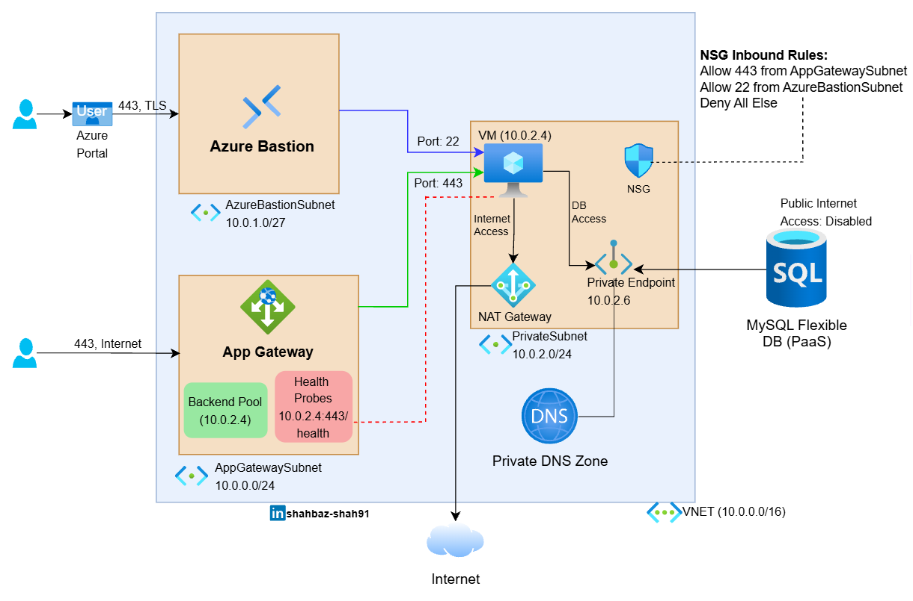

# Azure Web Application Infrastructure with Terraform

[](https://www.terraform.io/)
[](https://azure.microsoft.com/)

## Overview

Secure Infrastructure as Code (IaC) solution for deploying a scalable web application environment on Microsoft Azure. This architecture implements defense-in-depth security principles with network segmentation, private endpoints, and bastion host access.

> This repository serves as a secure baseline pattern for Azure web deployments and is designed for extensibility in production environments.

## Architecture Diagram



### Design Principles

- Secure by default (no public compute or database exposure)
- Explicit network boundaries and segmentation
- Controlled ingress and egress paths
- Private PaaS integration
- Infrastructure as Code for repeatability

### Key Components

- **Application Gateway**: Layer 7 load balancer with WAF capabilities for internet-facing traffic
- **Azure Bastion**: Secure RDP/SSH connectivity without exposing VMs to public internet
- **Virtual Machine**: Application hosting environment with private network placement
- **Azure MySQL Flexible Server**: PaaS database service with private endpoint integration
- **NAT Gateway**: Managed outbound internet connectivity for private resources
- **Private DNS Zone**: Internal DNS resolution for private endpoints

## Network Architecture

### Subnet Segmentation

The VNet (10.0.0.0/16) is segmented into three purpose-built subnets:

| Subnet | CIDR | Purpose | Resources |
|--------|------|---------|-----------|
| AppGatewaySubnet | 10.0.0.0/24 | Frontend ingress | Application Gateway, Public IP |
| AzureBastionSubnet | 10.0.1.0/27 | Secure management access | Azure Bastion |
| PrivateSubnet | 10.0.2.0/24 | Backend compute & data | VM (10.0.2.4), MySQL Private Endpoint (10.0.2.6) |

### Security Controls

**Network Security Groups (NSG)**
- Inbound allow rules for ports 443 and 22 from respective subnets
- Default deny-all rule for unspecified traffic
- Required Azure infrastructure probe allowance (168.63.129.16)

**Private Endpoints**
- MySQL Flexible Server accessible only through private endpoint (10.0.2.6)
- Public internet access disabled on database tier
- DNS resolution via Private DNS Zone

**NAT Gateway**
- Provides secure, managed outbound internet access for VM
- Eliminates need for public IP assignment on compute resources
- Ensures predictable egress IP for third-party service integrations

## Traffic Flow

### User → Application
1. User connects via HTTPS (443) over the internet
2. Traffic terminates at Application Gateway (public-facing)
3. Health probes monitor backend pool availability (10.0.2.4:443)
4. Application Gateway forwards requests to VM on port 443

### Application → Database
1. VM initiates connection to MySQL via private endpoint (10.0.2.6)
2. Private DNS Zone resolves MySQL FQDN to private IP
3. Traffic remains within Azure backbone network
4. No internet traversal required

### Administrative Access
1. Administrator connects to Azure Bastion via portal (443, TLS)
2. Bastion initiates RDP/SSH to VM (port 22) within VNet
3. No public IP required on VM
4. Session logging and audit trail maintained

### Outbound Internet Access
1. VM routes outbound traffic to NAT Gateway
2. NAT Gateway provides SNAT using its public IP
3. Enables software updates, API calls to external services
4. Return traffic flows back through NAT Gateway

## Prerequisites

- **Terraform**: >= 1.5
- **Azure CLI**: >= 2.40.0
- **Azure Subscription**: Active subscription with contributor access
- **Service Principal**: For automated deployments (optional)

## Project Structure

```
.
├── main.tf                 # Primary resource definitions and module use
├── variables.tf            # Input variable declarations
├── outputs.tf              # Output value definitions
├── provider.tf             # Azure provider configuration
├── locals.tf               # Local value definitions
├── vm.tf                   # Virtual machine resources
├── db.tf                   # MySQL database resources
├── appgw.tf                # Application Gateway configuration
├── modules/
│   └── network/
│       ├── nat.tf          # NAT Gateway configuration
│       ├── vnet.tf         # VNet and subnet definitions
│       ├── outputs.tf      # Network module outputs
│       └── variables.tf    # Network module variables
├── env/
│   └── preprod/
│       └── preprod.tfvars  # Environment-specific values
└── README.md
```

## Deployment

### Initialize Terraform

```bash
terraform init
```

### Plan Infrastructure Changes

```bash
terraform plan -var-file="env/preprod/preprod.tfvars"
```

### Apply Configuration

```bash
terraform apply -var-file="env/preprod/preprod.tfvars"
```
## Configuration

### Environment Variables

Create a `.tfvars` file for your environment:

```hcl
# env/preprod/preprod.tfvars
vnet_address_space = ["10.0.0.0/16"]

subnets = {
  appgw = {
    cidrs = ["10.0.0.0/24"]
    name = "appgw"
    outbound_access_allow = true
    attach_nat = false
  }

  private = {
    cidrs = ["10.0.2.0/24"]
    name = "private"
    outbound_access_allow = false
    attach_nat = true
  }

  bastion = {
    cidrs = ["10.0.1.0/27"]
    name = "AzureBastionSubnet"
    outbound_access_allow = true
    attach_nat = false
  }
}

private_subnet_key = "private"
public_subnet_key = "appgw"

environment = "preprod"
location = "switzerlandnorth"
```


## Security Best Practices

**Implemented**
- Private endpoints for PaaS services (MySQL)
- Network segmentation with dedicated subnets
- NSG rules following principle of least privilege
- Bastion host for secure administrative access
- NAT Gateway for controlled outbound connectivity
- No public IPs on compute/database resources

**Recommendations for Production**
- Enable Azure DDoS Protection Standard
- Configure Application Gateway WAF in prevention mode
- Implement Azure Key Vault for secrets management
- Enable diagnostic logs and Azure Monitor alerts
- Configure automated backups for MySQL database
- Implement Azure Policy for governance
- Use managed identities for service-to-service auth

## Monitoring & Logging

Recommended monitoring setup (not included in current implementation):

- Application Gateway access and performance logs
- NSG flow logs for traffic analysis
- VM diagnostics and performance metrics
- MySQL query performance insights
- Azure Monitor alerts for critical thresholds

## Troubleshooting

### Common Issues

**Application Gateway health probes failing**
- Verify VM NSG allows traffic from Azure Load Balancer (168.63.129.16)
- Ensure web service is listening on configured backend port
- Check health probe path returns HTTP 200

**Cannot connect to MySQL**
- Verify private endpoint is properly configured
- Check private DNS zone linked to VNet
- Ensure VM has network connectivity to 10.0.2.6

**SSH timeout to VM via Bastion**
- Confirm Bastion subnet has /27 or larger CIDR
- Verify NSG on Bastion subnet allows required traffic
- Check VM NSG allows SSH (22) from Bastion subnet

## Author

**Shahbaz Shah**

[](https://linkedin.com/in/shahbaz-shah91)

## Acknowledgments

- Microsoft Azure documentation
- HashiCorp Terraform best practices
- Azure architecture patterns and reference implementations

---
